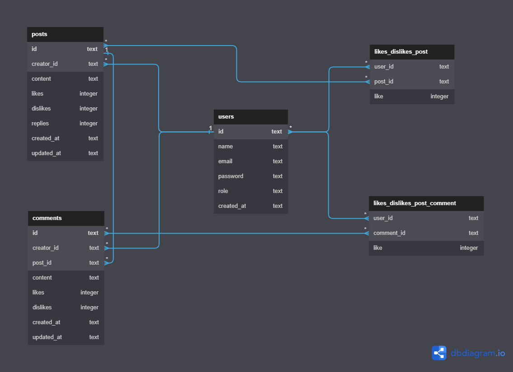

<h1 align="center">
     Projeto Labeddit-fullstack - Backend
</h1>

<h4 align="left">
   Projeto Backend/API baseado em uma rede social
</h4>

---

### 📖 Objetivo do Projeto

Este projeto de Back-end tem como principal objetivo estudar e compreender a arquitetura em camadas e a programação orientada a objetos. Além disso, é utilizado um conjunto de bibliotecas para geração de UUIDs e hashes no processo de autenticação e autorização. O foco também é adquirir maior experiência com Node.js, TypeScript, Express, SQL, SQLite, Knex, Jest, Postman e roteamento.

### Funcionalidades do Projeto

-  Criação e login de usuários
-  Login de Usuários
-  Criação, edição e deleção de Postagens
-  Autenticação via token JWT
-  Senhas hasheadas com Bcrypt
-  Identificação UUID
-  Ambiente de testes

### Executando o projeto
- npm install: Instala todas as dependências do projeto
- npm run dev: Estabelece a conexão com o banco de dados e reinicia automaticamente o servidor localhost

## 💻 Tecnologias 

- Para acessar a documentação do projeto, clique [aqui](https://documenter.getpostman.com/view/27038980/2s946h6r1d).